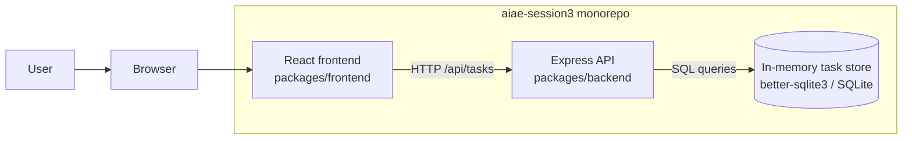
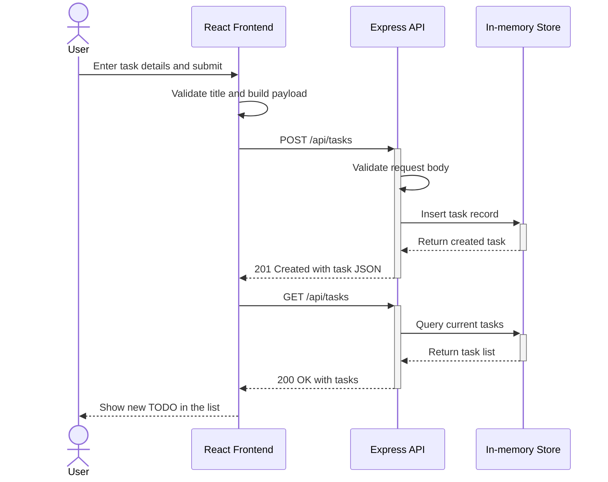

# Cloud Architecture Overview

This document includes both a high-level system context view and a runtime sequence view for the Todo monorepo.

## System Context

This diagram shows the high-level system context for the monorepo: a React frontend calling an Express API backed by an in-memory task store.

## Create TODO Sequence

This sequence diagram shows the runtime flow for a user creating a TODO in the monorepo application.

